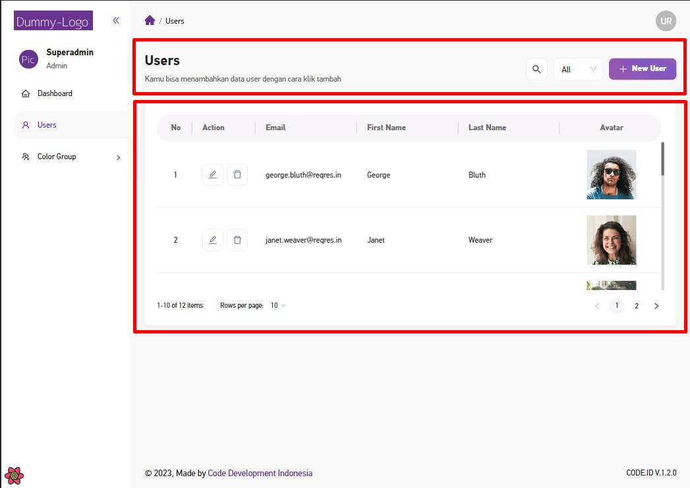

# `/Features` Directory

## Apa itu feature-based directory structure?

Boilerplate sekarang menerapkan `feature-based directory structure`. Sederhananya setiap fitur yang dibuat, dikumpulkan dalam folder `/features`.

Sebut saja anda memiliki fitur untuk mengelola users. Alih-alih menggabungkan semua komponent didalam satu route pages `/users`, anda dapat meng-ektrak komponent-komponent seperti header, table, dan modal ke dalam folder `/features/users/ui`. Anda juga dapat mengelompokkan hooks dan types react didalam folder `/features/users/hooks` dan `/features/users/types`.

Ini akan mengisolasi fitur tersebut dan membuat kesan kode lebih rapi dan mudah dimaintain.

## Contoh

1. Anda memiliki sebuah fitur kelola user, dimana terdapat komponent Header, Table dan Modal.



2. Alih-alih menulis kode komponent tersebut didalam `/pages/users/index.tsx`, kita dapat mengelompokkannya didalam folder `/features/users/ui`.

```jsx title="/features/users/ui/TableUser.tsx"
export default function TableUser() {...}
```

```jsx title="/features/users/ui/ModalAddUser.tsx"
export default function ModalAddUser() {...}
```

3. Pasang komponent yang sudah dibuat ke dalam `/pages/users`

```jsx title="/pages/users/index.tsx"
import { Space } from 'antd';
import SectionData from '@/features/users/ui/TableUser';
import ModalAddUser from '@/features/users/ui/components/ModalAddUser';
import MainTitlePage from '@/shared/components/organisms/MainTitlePage';
...
function Users() {
  // state
  ...
  // hooks
  ...
  return (
    <Space direction="vertical" size={20} style={{ display: 'flex' }}>
      {/* MainTitlePage is a Shared component */}
      <MainTitlePage
        ...props
      />
      {/* Table Users */}
      <TableUser 
        ...props />
      {/* Modal Add User */}
      <ModalAddUser
        ...props />
    </Space>
  );
}
```

4. Anda pasti menyadari terdapat komponent `<MainTitlePage />` yang di-import dari folder `shared`. Komponent ini adalah komponent yang *reusable*. Lebih lanjut anda dapat mempelajarinya pada bagian [`Shared Directory`](./shared-directory).

## Referensi 
- [React Folder Structure by profy.dev](https://profy.dev/article/react-folder-structure#:~:text=%E2%94%94%E2%94%80%E2%94%80%20terms/-,Exit%3A%20Group%20by%20Features,-As%20we%20sell)